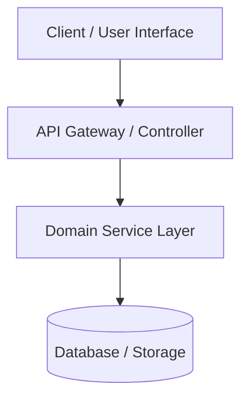
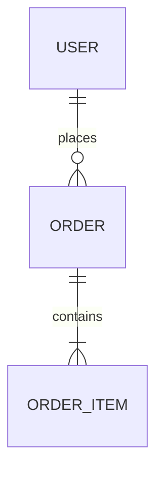

# Architecture Design Skill (`/architecture-design`)

Verwende diesen Skill, wenn eine Systemarchitektur, Komponentenstruktur, API-Spezifikation oder Datenmodellierung entworfen, dokumentiert oder grundlegend refaktoriert werden soll.

---

## Wann verwenden?
Verwende diesen Skill, wenn:
- Neue Systeme, Microservices oder Module strukturell entworfen werden.
- Modulgrenzen, Datenflüsse und Schnittstellen zwischen Komponenten festgelegt werden müssen.
- Technische Richtentscheidungen (Architecture Decision Records / ADRs) zu treffen und zu begründen sind.
- Architekturdiagramme (z. B. C4-Modell, Sequenz- oder ER-Diagramme mit Mermaid) erstellt oder aktualisiert werden sollen.
- Eine verständliche und nachhaltige Systemdokumentation im Ordner `./agents/` benötigt wird.

---

## Workflow

1. **Kontextanalyse & Ist-Zustand:**
   - Analysiere fachliche Anforderungen (`./agents/REQUIREMENTS.md` oder User-Input) und bestehenden Code/Strukturen im Projekt.
   - Identifiziere Schlüsselkomponenten, Abhängigkeiten, externe Systeme und Datenflüsse.

2. **Architektur- & Systementwurf:**
   - **Komponenten & Modulgrenzen:** Definiere Verantwortlichkeiten (Single Responsibility Principle) und Entkopplung (Loose Coupling / High Cohesion).
   - **Datenmodelle & Schnittstellen:** Formuliere API-Schnittstellen (REST/GraphQL/gRPC) und Datenstrukturen.
   - **Architekturentscheidungen (ADRs):** Dokumentiere Kernentscheidungen mit Kontext, Alternativen und Konsequenzen.
   - **Diagramme:** Visualisiere die Architektur mit Mermaid.js (System-Überblick, Sequenzdiagramme, ER-Diagramme).

3. **Dokumentation im Ordner `./agents/`:**
   - Speichere das Ergebnis zwingend als eindeutige Markdown-Datei im Ordner `./agents/` im Projekt-Root (z. B. `./agents/ARCHITECTURE.md` für Gesamtsysteme oder `./agents/ARCHITECTURE-<modul/feature>.md` bei spezifischen Subsystemen).

---

## Qualitätsregeln

- **Eindeutige Datei im `./agents/`-Ordner:** Das Ergebnis **muss** immer als eindeutige Markdown-Datei (z. B. `./agents/ARCHITECTURE.md` oder `./agents/ARCHITECTURE-<system/feature>.md`) im Ordner `./agents/` des Projekts gespeichert werden.
- **Visualisierung mit Mermaid:** Verwende valide Mermaid.js Code-Blöcke (`mermaid`) für Diagramme (C4 Component, Sequence, ER-Diagramme).
- **Pragmatismus (KISS & DRY):** Vermeide über-komplizierte Architekturen (YAGNI). Wähle das einfachste Design, das alle funktionalen und nicht-funktionalen Anforderungen erfüllt.
- **Traceability:** Verknüpfe Architekturkomponenten direkt mit den fachlichen Anforderungen (`REQUIREMENTS.md`) und dem Quellcode im Projekt.

---

## MCP-Integration (Optional)

- **GitHub MCP:** (`create_issue`, `create_pull_request`, `search_code`) – Verknüpfung von Architekturentscheidungen mit PRs und Issues.
- **Memory MCP:** (`create_entities`, `create_relations`) – Speicherung von Architekturelementen und Abhängigkeiten im Wissensgraph.

---

## Output-Format

Erstelle den Architekturentwurf im folgenden Markdown-Format:

```markdown
# Systemarchitektur: [System/Modul-Name]

> **Version:** 1.0.0  
> **Status:** Draft / Approved / In Review  
> **Letzte Änderung:** YYYY-MM-DD  

## 1. Übersicht & Ziele
* **Zweck:** <Kurze Beschreibung des Systems/Moduls>
* **Kernanforderungen:** <Bezug zu REQUIREMENTS.md>
* **Nicht-funktionale Ziele:** <Skalierbarkeit, Performance, Sicherheit, Wartbarkeit>

## 2. Systemarchitektur & Komponenten (C4 Modell)



### 2.1 Komponenten-Beschreibung
| Komponente | Verantwortung | Technologie / Pattern | Schnittstellen |
| :--- | :--- | :--- | :--- |
| **API Gateway** | Routing, Authentication, Input Validation | REST / Express / FastAPI | HTTP / JSON |
| **Service Layer** | Business Logic, Domain Execution | Pure Functions / Domain Services | Internal API |
| **Database** | Persistence, Query Execution | PostgreSQL / Prisma | SQL / Driver |

## 3. Datenmodell & Schnittstellen

### 3.1 ER-Diagramm (Datenmodell)


### 3.2 Schnittstellen-Spezifikation (APIs)
* **`POST /api/v1/resource`**
  - **Input:** `{ "name": "string", "type": "string" }`
  - **Output (201 Created):** `{ "id": "uuid", "status": "active" }`

## 4. Architecture Decision Records (ADRs)

### ADR-01: [Titel der Entscheidung, z. B. Wahl der Datenbank]
* **Kontext:** <Warum wurde eine Entscheidung benötigt?>
* **Entscheidung:** <Welche Option wurde gewählt?>
* **Alternativen:** <Welche Optionen wurden evaluiert und verworfen?>
* **Konsequenzen:** <Positive und negative Auswirkungen>

## 5. Offene Punkte & Risiken
* [ ] <Offener Punkt / Architekturrisiko>
```
